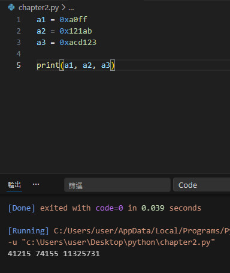
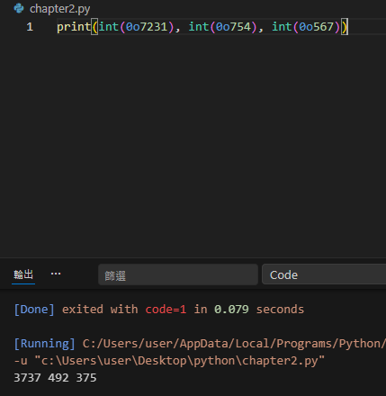
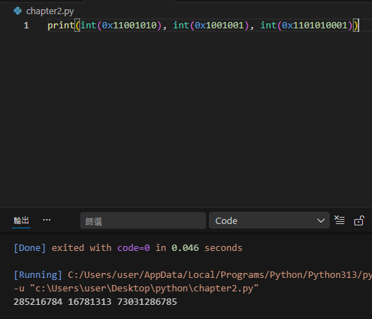
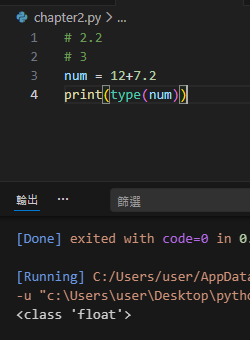

# 2
## 2.1
### 1.
(a) str  
(b) bool  
(c) int  
(d) float  
(e) bool  
(f) float  
(g) float  
(h) float  
(i) int  
(j) int  
(k) complex  
(l) int  
(m) str  

### 2.
(a)  
(b) 
(c) 

## 2.2
### 3.

### 4
